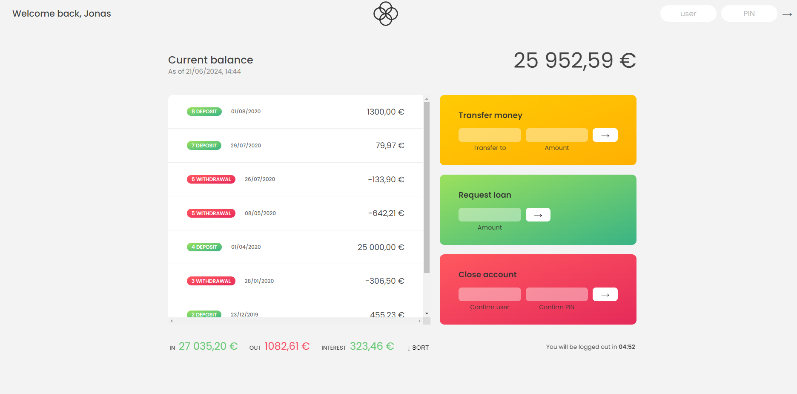

# Bank Management Project

A fully-functional Bank Management System built with pure JavaScript, HTML, and CSS. This project handles user authentication, account management, transactions, and more, all without relying on external libraries or frameworks.

## Features

- **User Authentication**: Secure login using username and PIN.
- **Account Management**: Create and manage multiple user accounts.
- **Transactions**: Perform deposits and withdrawals with ease.
- **Balance Display**: Check account balances in real-time.
- **Transaction History**: View transaction history with dates and formatted amounts.
- **Loan Requests**: Request loans if certain conditions are met.
- **Automatic Logout**: User is automatically logged out after 5 minutes of inactivity for security purposes.

## Demo

[[Insert a link to your live demo if available](https://vishalfirgan.github.io/BankEasy/)]

## Screenshots

*User Dashboard*

